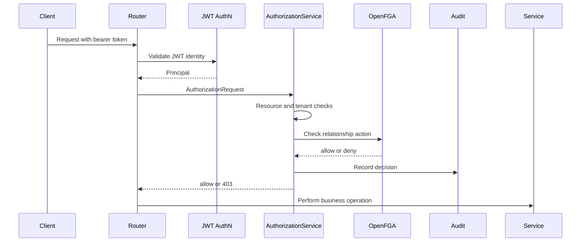

# SecureShare Developer Guide

This guide is for developers changing SecureShare code. It explains the application boundaries, authorization invariants, and safe extension patterns.

## Golden Rules

- JWTs prove identity only. Do not put document roles, permissions, group membership, or OpenFGA-derived state into JWT claims.
- The app must fail closed if default signing keys are used without an explicit local-dev opt-in.
- Business services do not authorize. They may create, fetch, or mutate data only after a router or dependency has called `AuthorizationService`.
- All document authorization decisions go through `AuthorizationService`.
- Every allow and deny from `AuthorizationService` must be auditable.
- Revocation must be live. A stale JWT must not preserve access after an OpenFGA tuple is removed.
- Cross-tenant checks happen before returning resource data.
- Delegated tokens are attenuated read tokens, not a second authorization system.

## Code Map

| Path | Purpose | Notes |
| --- | --- | --- |
| `apps/api/app/main.py` | FastAPI app factory | Registers middleware and routers. Keep startup wiring here. |
| `apps/api/app/config.py` | Runtime settings | Environment-driven settings via Pydantic. Do not hardcode secrets elsewhere. |
| `apps/api/app/db/session.py` | SQLAlchemy engine/session | Owns database session dependency. |
| `apps/api/app/models/` | SQLAlchemy persistence models | Application data only. OpenFGA relationships are not duplicated here. |
| `apps/api/app/schemas/` | Pydantic request/response models | Validation and API shape. No authorization decisions. |
| `apps/api/app/auth/` | Authentication helpers | JWT issuing/validation and password hashing. |
| `apps/api/app/authz/models.py` | Authorization request/decision types | Shared vocabulary for actions and roles. |
| `apps/api/app/authz/client.py` | OpenFGA client boundary | Converts application IDs into OpenFGA object/user refs. |
| `apps/api/app/authz/service.py` | Central authorization service | The only place document access decisions are made. |
| `apps/api/app/middleware/pep.py` | Request context middleware | Adds request IDs used in audit logs. |
| `apps/api/app/routers/` | HTTP endpoints | Routers authenticate, build authorization requests, and call services. |
| `apps/api/app/services/` | Business operations | No direct authorization logic. |
| `apps/api/app/audit/service.py` | Audit persistence | Writes every authorization decision. |
| `infra/openfga/` | Relationship model and seed tuples | Keep JSON and FGA model semantically aligned. |
| `apps/api/tests/` | Security-focused test suite | Add regression tests before changing auth behavior. |

## Request Lifecycle

1. `RequestContextMiddleware` attaches `request.state.request_id`.
2. `get_current_principal` validates the bearer JWT and loads the current user.
3. The router builds an `AuthorizationRequest` with user, tenant, resource, action, and request ID.
4. `AuthorizationService.require()` calls `authorize()`.
5. `authorize()` loads the resource, checks tenant boundary, asks OpenFGA, and writes an audit row.
6. The router calls a business service only after authorization succeeds.



## Authentication Rules

`apps/api/app/auth/jwt.py` pins JWT validation to `HS256`, verifies issuer and audience, and requires `sub`, `tenant_id`, `email`, `exp`, `iat`, and `nbf`.

When changing JWT handling:

- Keep `algorithms=[ALGORITHM]`; never accept algorithms from token headers.
- Keep issuer and audience verification.
- Keep authorization state out of the token.
- Keep the startup guard that rejects insecure default signing keys unless local development explicitly opts in.
- Add tests for malformed, expired, and weak-algorithm tokens.

## Authorization Rules

`AuthorizationService` is the policy decision boundary inside the API. It currently enforces:

- resource existence
- tenant boundary
- OpenFGA relationship decision
- audit logging

The service returns `AuthorizationDecision` for internal use and `require()` raises `403` for route enforcement.

When adding a protected document endpoint:

```python
authz.require(
    AuthorizationRequest(
        user_id=principal.user_id,
        tenant_id=principal.tenant_id,
        resource_type="document",
        resource_id=document_id,
        action=Action.READ,
        request_id=request.state.request_id,
    )
)
```

Then, and only then, call a business service.

Share-path invariants:

- sharing is tenant-local only
- `owner` is not a normal share role
- ownership transfer needs a dedicated workflow, not the generic share endpoint

## OpenFGA Model

The OpenFGA model defines:

- `user`
- `tenant`
- `group`
- `document`

Document permissions:

- `owner` grants `can_share`, `can_edit`, `can_comment`, `can_read`
- `editor` grants `can_edit`, `can_comment`, `can_read`
- `commenter` grants `can_comment`, `can_read`
- `viewer` grants `can_read`

Group grants use `group:<id>#member`. Do not expand group permissions into per-user tuples in application code.

When changing OpenFGA relationships:

- Update both `infra/openfga/model.fga` and `infra/openfga/model.json`.
- Update `apps/api/app/authz/client.py` mappings if action or role names change.
- Update seed tuples and tests together.

## Delegation Tokens

`DelegationService` issues Macaroon-style read tokens. Caveats currently include:

- `action = can_read`
- `document_id = <document_id>`
- `tenant_id = <tenant_id>`
- `issuer_user_id = <user_id>`
- `expires_before = <unix_timestamp>`
- optional `ip = <ip_address>`

Delegated read flow:

1. Verify Macaroon signature.
2. Verify all caveats.
3. Perform a live OpenFGA read check for the issuing user.
4. Return the document only if the issuer still has access.

This means revoking the issuer's OpenFGA relationship invalidates delegated access immediately.

## Audit Logging

Every `AuthorizationService.authorize()` call writes to `audit_logs`.

Required fields:

- timestamp
- request ID
- user ID
- tenant ID
- resource
- action
- allow or deny
- reason
- decision source

If you introduce a new authorization path, route it through `AuthorizationService` or add equivalent audit coverage before merging.

## Adding A New Protected Endpoint

1. Add or reuse a Pydantic schema in `apps/api/app/schemas`.
2. Add service logic in `apps/api/app/services` without authorization checks.
3. Add a router handler in `apps/api/app/routers`.
4. Require `Principal` with `get_current_principal`.
5. Require `AuthorizationService` with `get_authorization_service`.
6. Build an `AuthorizationRequest`.
7. Call `authz.require(...)`.
8. Call the business service.
9. Add tests for allow, deny, tenant mismatch, and revocation if relevant.

## Adding A New Permission

1. Add the permission to `Action` in `apps/api/app/authz/models.py`.
2. Add the OpenFGA relation in `infra/openfga/model.fga`.
3. Mirror it in `infra/openfga/model.json`.
4. Add mapping in `ACTION_TO_RELATION`.
5. Add route enforcement using the new action.
6. Add tests proving denied users cannot reach the object by ID.

## Adding A New Role

1. Add the role to `Role` in `apps/api/app/authz/models.py`.
2. Add the relation to the OpenFGA document type.
3. Add role-to-relation mapping in `ROLE_TO_RELATION`.
4. Update share request validation in `apps/api/app/schemas/documents.py`.
5. Update seeds and tests.

## Test Strategy

The fast test suite uses SQLite plus `FakeRelationshipClient`. This keeps authorization regressions quick to catch without a real OpenFGA server.

Minimum coverage for authorization changes:

- owner allowed
- lower role denied for higher action
- non-member denied
- cross-tenant denied
- stale JWT denied after tuple revocation
- audit entry written for allow and deny

Delegation changes also need:

- expired token denied
- wrong caveat denied
- revocation of issuer access invalidates token

## CI And Supply Chain Checks

CI uses UV for deterministic installs from `uv.lock`.

The workflow:

- runs tests
- validates Docker Compose
- builds the API image
- generates CycloneDX SBOM
- scans source and image with Trivy
- uploads SARIF reports
- signs artifacts with Cosign keyless signing on non-PR events

Dependency automation uses cooldowns to reduce supply-chain risk from freshly published releases.

## Swagger And OpenAPI

FastAPI serves interactive Swagger UI at `/docs`, ReDoc at `/redoc`, and the raw OpenAPI document at `/openapi.json`.

The committed OpenAPI artifact lives at `docs/openapi.json`. Regenerate it after route or schema changes:

```bash
PYTHONPATH=apps/api uv run python scripts/export_openapi.py
```

## Common Pitfalls

- Do not check document ownership directly in routers.
- Do not add `roles` or `permissions` claims to JWTs.
- Do not trust tenant IDs from request bodies for resource access.
- Do not return `404` details after an authorization denial unless the denial path is intentionally designed to hide existence.
- Do not create delegated tokens without first checking the issuer's current access.
- Do not forget audit logging when adding a new authorization source.
- Do not update route schemas without regenerating `docs/openapi.json`.
